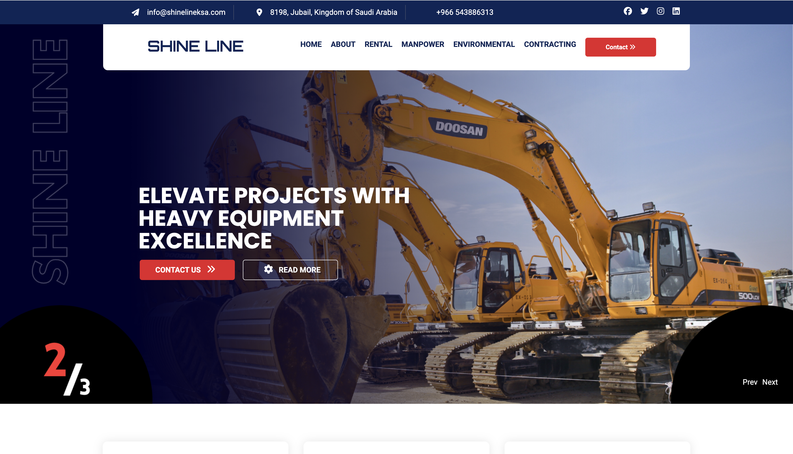
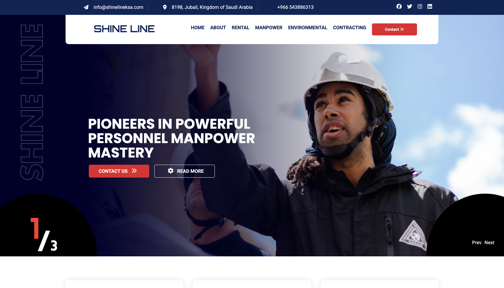
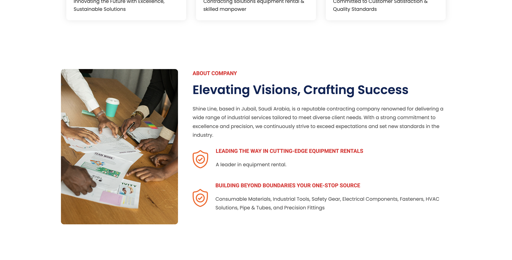
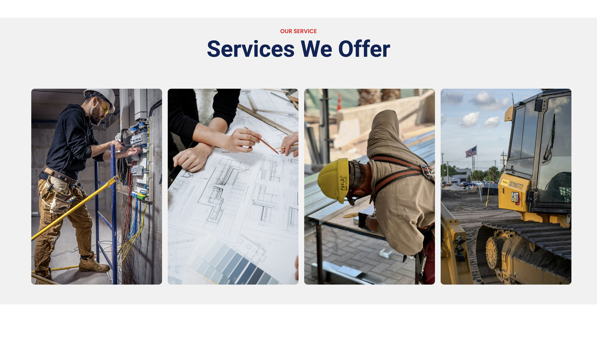
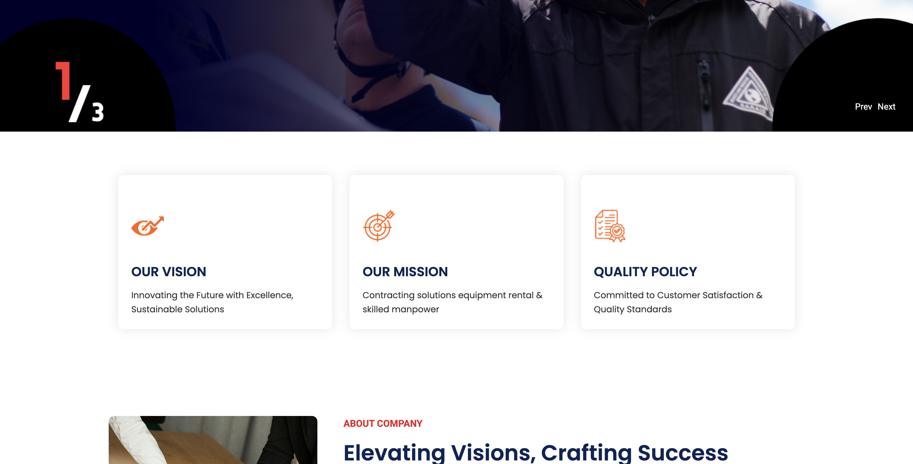
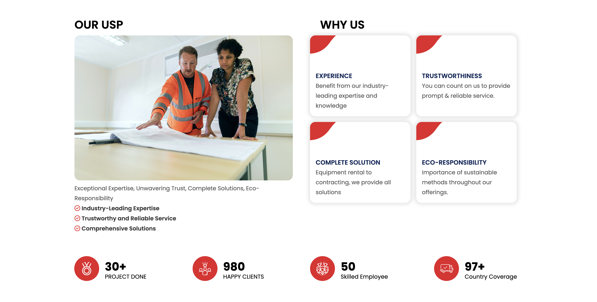
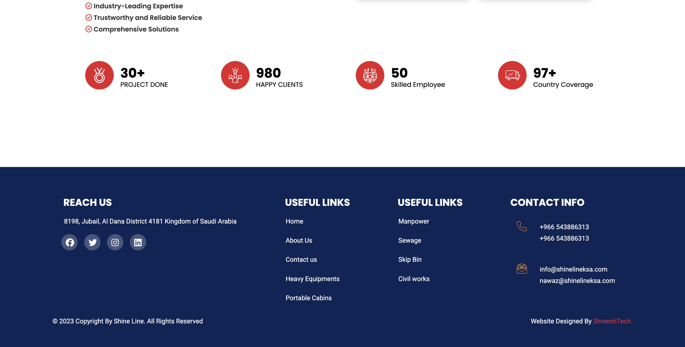

## About the Project

This project was developed during my internship at ShreeshTech for Shine Line, an industrial contracting and manpower company based in Saudi Arabia. I worked on the development of the **homepage module**, focusing on its structure, layout, styling, navigation, interactive elements, and responsive presentation.

The homepage opens with a rotating hero slideshow presenting the company's industrial equipment and manpower services.





The remaining sections present the company's background, services, vision, mission, policy, and key strengths, followed by the site's footer.











## My Contribution

I developed the homepage structure using HTML and handled its visual styling with CSS. I implemented interactive functionality using JavaScript, created the navigation and homepage sections, integrated the required images and visual assets, and worked on the responsive layout to ensure the page adapted across different screen sizes.

## Technologies Used

**HTML5 · CSS3 · JavaScript · Font Awesome · Google Fonts**

## Project Structure

```text
ShineLine/
│
├── ASSETS/
│   └── Website images and other assets
│
├── SCRIPT/
│   └── ShineLineScript.js
│
├── STYLE/
│   └── ShineLineStyle.css
│
├── ShineLineStructure.html
└── README.md
